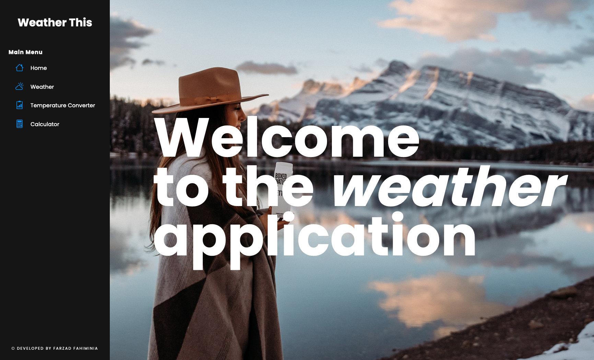
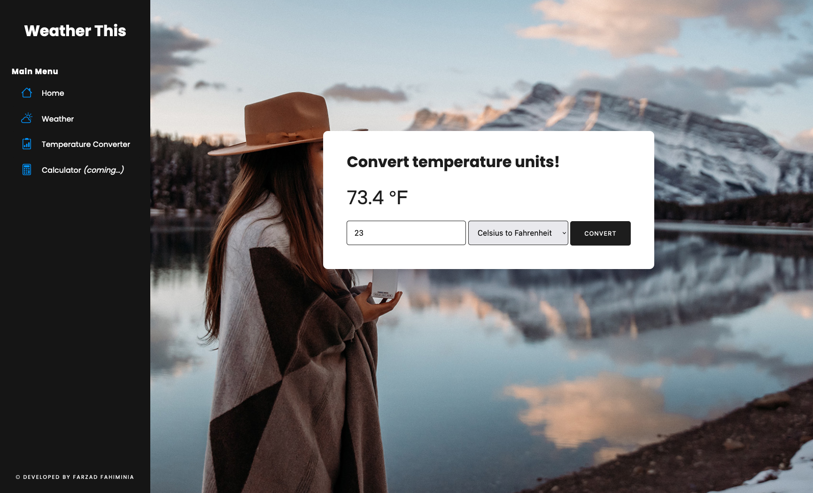
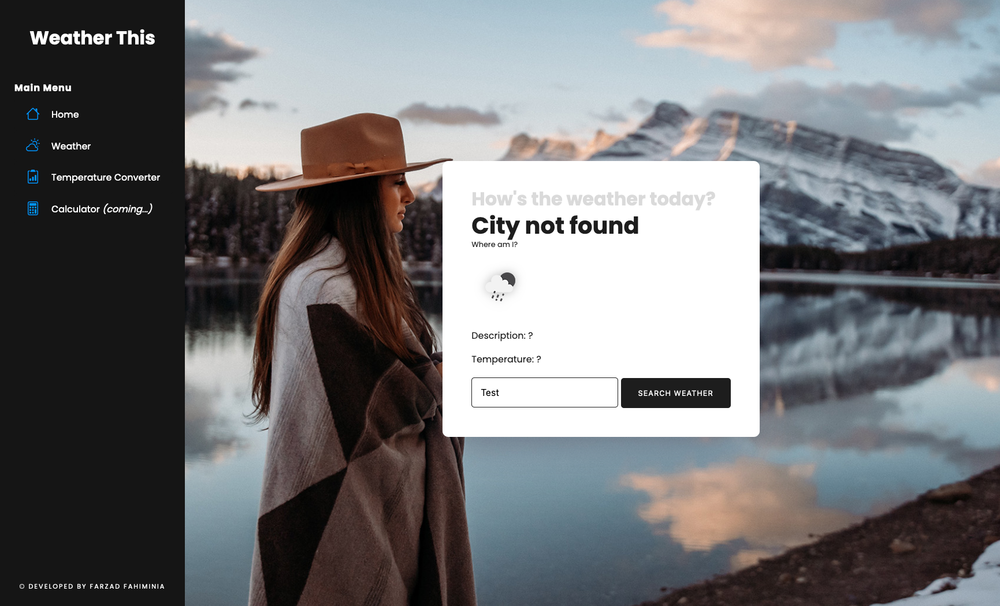

# Developer - Inlämning laboration 2, 1dv610

## Vision
Min vision är att ta fram en väder-applikation som har allting väderrelaterad. Till en början finns det att hämta vädret via ett API där du kan se nuvarande väder i olika städer. En temperaturomvanldare är även implementerats där man kan omvandla olika enheter till varandra (Celsius, Fahrenheit, Kelvin).

### Framtida visioner
Framtida visioner är att kunna expandera väderrapporteringen med fler prognoser och dagar, samt att utöka med detaljer både kring information och det visuella.

## Testrapport (manuella tester)

https://github.com/Farzad-Fahiminia/Mjukvarukvalitet-L2/issues?q=is%3Aissue+is%3Aclosed

| Test | Beskrivning               | Utfall PASS/FAIL |
|------|---------------------------|------------------|
| UC1 | Starta applikationen och se om man kommer till startsidan. |  Pass  |
| UC2 | Att använda sig av main menu (navigering).                 |  Pass  |
| UC3 | Att använda sig av weather-komponenten.                    |  Pass  |
| UC4 | Att använda sig av Temperature Converter-komponenten.      |  Pass  |
| UC5 | Att använda sig av weather-komponenten och skriva fel eller en stad som inte finns. |  Pass  |

 

### UC1
<b>Beskrivning:</b> Starta applikationen och se om man kommer till startsidan.

<b>Testinstruktion</b>
1. Navigera till roten av applikationsmappen.
2. Skriv in `npm run dev`
3. Öppna URL:en som finns liknande denna exempel här `Local:   http://localhost:5173/` i en webbläsare.

<b>Förväntad resultat</b>
Nu borde du se startsidan på applikationen som bilden nedan.

### UC2
<b>Beskrivning:</b> Att använda sig av main menu (navigering).

<b>Testinstruktion</b>
1. Navigera till roten av applikationsmappen.
2. Skriv in `npm run dev`
3. Öppna URL:en som finns liknande denna exempel här `Local:   http://localhost:5173/` i en webbläsare.
4. Klicka på länkarna i "Main Menu" för att navigera mellan sidorna.

<b>Förväntad resultat</b>
Du borde kunna se sidor som bilden nedan.

### UC3
<b>Beskrivning:</b> Att använda sig av weather-komponenten.

<b>Testinstruktion</b>
1. Navigera till roten av applikationsmappen.
2. Skriv in `npm run dev`
3. Öppna URL:en som finns liknande denna exempel här `Local:   http://localhost:5173/` i en webbläsare.
4. Klicka på länken "Weather" i "Main Menu".
5. Skriv "Kalmar" i textfältet och tryck på knappen "Search Weather".

<b>Förväntad resultat</b>
Du borde kunna se väderinformation om Kalmar.

### UC4
<b>Beskrivning:</b> Att använda sig av Temperature Converter-komponenten.

<b>Testinstruktion</b>
1. Navigera till roten av applikationsmappen.
2. Skriv in `npm run dev`
3. Öppna URL:en som finns liknande denna exempel här `Local:   http://localhost:5173/` i en webbläsare.
4. Klicka på länken "Temperature Converter" i "Main Menu".
5. Skriv "23" i fältet och tryck sedan på knappen "Convert". Se till att omvandla från Celsius till Fahrenheit.

<b>Förväntad resultat</b>
Du borde kunna se en temperatur på 73.4 ℉.

### UC5
<b>Beskrivning:</b> Att använda sig av weather-komponenten och skriva fel eller en stad som inte finns.

<b>Testinstruktion</b>
1. Navigera till roten av applikationsmappen.
2. Skriv in `npm run dev`
3. Öppna URL:en som finns liknande denna exempel här `Local:   http://localhost:5173/` i en webbläsare.
4. Klicka på länken "Weather" i "Main Menu".
5. Skriv "Test" i textfältet och tryck på knappen "Search Weather".

<b>Förväntad resultat</b>
Du borde se "City not found"-meddelandet.

