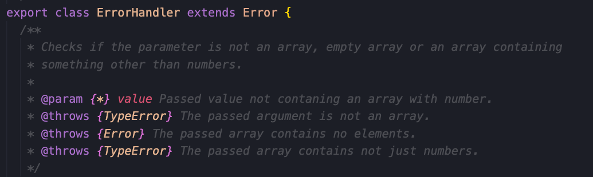

# Reflektion från Clean Code (kap 2-11)
## Kap 2 - Meaningful Names.
För mig var det ett väldigt nyttigt kapitel att läsa, och det var smart att sätta just detta ämne tidigt i boken. All kod som skrivs, tolkas. Vi är alla olika individer med olika bakgrund så för att underlätta för alla så är det superviktigt att använda kodnamn som är tydliga. Jag tog lärdom av detta kapitel och använde mig av en hel del av hans regler för att få så tydliga kodnamn som möjligt. Use Intention-Revealing Names, var den delen som gjorde att jag tänkte om med namn i L1an. Jag har ändrat namn jag tyckte kunde förtydligas och det var istället för calculateMinimum och calculateMaximum så blev det lowestValueInArray och highestValueInArray. <i>"Choosing good names takes time but saves more than it takes."(s.49).</i>

## Kap 3 - Functions.
Efter att ha tagit del av detta kapitel så har mina funktioner blivit kortare (Small!). För mig var det viktigt att skriva utförliga funktioner, men det går att vara utförlig men kort samtidigt. Självklart finns det undantag då en funktion behöver lite fler rader, men den kan fortfarande vara kort, tydlig och välstrukturerad. Jag kollar numera alltid om det går att skala ner eller omstrukturera för att få mina funktioner kortare. I just denna uppgift så har jag faktiskt en if...else sats i min try/catsh som är på tok för lång i min my-custom-temp-converter. I boken tar dem upp detta och menar att det är bättre att extrahera try/catch block om de är för stora eller gör för många saker. På grund av tidsbrist så hann jag inte med att fixa detta.

## Kap 4 - Comments.
Han säger att om vi bara hade skrivit våran kod tydligare så hade inte kommentarer behövts, men jag tycker att kommentarer är nödvändigt, hur tydlig din kod än är, så har vi fastställt i kap 2 att alla har olika bakgrund och tolkningar på kod. Kommentarerna sätter koden i ett perspektiv. Kommentarer vid parametrar och retursatser är väldigt hjälpsamma likaså metodkommentarer kan vara hjälpsamt att överblicka när man inte har tid att analysera koden, även om den är tydligt skriven. Sen måste ju kommentarerna också underhållas, flyttas med, skrivas om etc, vilket tar mer tid från ditt kodande, så kanske man vill lägga lite extra tid på att skriva tydlig kod än kommentarer.

## Kap 5 - Formatting.
Från start har jag alltid uppskattat en tydlig formatering inte bara på mina koder och utan även andras koder. Indentering (se bild) är något jag använder mig av alltid. Det sparar mycket tid och energi när man sitter längre stunder och skriver kod, man tar pause, kommer tillbaka och kan lätt navigera sig dit man vill med blicken. Som han skriver i boken så är ju en automatiserad variant av formatering att föredra, vi använder ju oss av EsLint och LNU standard när det kommer till formateringen. En bra visualisering som han tog upp var tidningen (The Newspaper Metaphor). Man vill ha det viktigaste först och sen de mindre viktiga detaljerna, high-level först och low-level sist.

## Kap 6 - Objects and Data Structures.
Knepigt kapitel. Det jag tog till mig i alla fall var <i>”talk to friends, not to strangers”</i>(s.129). Metoder ska inte anropa metoder på objekt som returneras av något av de tillåtna funktionerna, The Law of Demeter. Jag har inget eget exempel på detta, men kommer absolut ha det med mig när jag kodar i framtiden.

## Kap 7 - Error Handling.
<i>”In short, things can go wrong, and when they do, we as programmers are responsible for making sure that our code does what it needs to do.(s.134)”</i> Det här summerar hela kapitlet enligt mig. Jag tycker det ska vara tydligt vad och varför det blivit fel. Att skapa informativa felmeddelanden och skicka dem tillsammans med undantag. Nämna operationen som misslyckades och typen av fel. I mina tester på L1 till exempel så returneras en sträng med ett tydligt meddelande vad som gått fel. Jag kontrollerar att det som skickas in är mätbart med det som applikationen kan göra, annasr kastas ett fel.

## Kap 8 - Boundaries.
Boken tar upp i delen Exploring and Learning Boundaries att en tredjepartkod i form av en API skulle ta alldeles för lång tid att sätta sig in i och förstå, och att man då istället kan använda sig av tester.  Vi kan då se om APIn gör det vi vill att den ska göra. Det hjälper oss även i längden om det skulle bli en uppdatering av APIn så kan vi köra testet igen, utan testet kanske vi hade stannat med en gammal version av APIn. Detta gör att vi kan använda oss av APIn och spara tid, eftersom vi då kan implementera tredjepartskoden i vårat projekt. Jag uppskattar den här inblicken och tycker det är ett smart sätt att använda sig av tredjepartkod, kommer absolut att använda mig av detta i framtida projekt. I my-custom-weather-app så använder jag mig av API för att få fram vädret i olika städer, det funkade, jag fick feedback och då körde jag på det.

## Kap 9 - Unit Tests.
Enligt boken är det enhetstesterna som håller koden flexibel, underhållsbar och återanvändbar. Jag kan inte annat än hålla med. Jag använder mig av tester just för att kunna våga och göra ändringar i min kod, samt också testa att den får det utfall jag önskar.<i>"What makes a clean test? Three things. Readability, readability, and readability."(s.155)</i> Jag vill tycka att mina tester i L1 är Clean Tests, då de är tydliga, enkla och lätta att förstå. De är snabba och returnerar ett falskt eller sant värde för att visa om testet är godkänt eller inte. Jag har två tester per metod.

## Kap 10 - Classes.
Vi har lärt oss att klasser ska vara små (precis som funktioner) och det säger även boken. Att klassen ska namnges efter en beskrivning av vad klassen har för ansvar. Det är nästan namnet på klassen som avgör storlek på klassen. <i>"If we cannot derive a concise name for a class, then it’s likely too large."(s.169)</i> Jag kan inte annat än att hålla med. Jag döpte mina klasser efter vad de har för ansvar. Jag upplever att storleken på dem är små och inte gör för mycket. Min ErrorHandler är ett exempel på detta (se bild), Den gör en sak, errorhantering, den går att använda på andra projekt. I L2:an så har jag gjort komponenter som är uppbyggda på samma sätt, de är oberoende av varandra, kan lyftas ut och användas separat.

## Kap 11 - Systems.
Scaling Up, varför byggdes inte Ölandsbron bredare? Vem skulle kunna rättfärdiga en bro över vattnet med tre filer på varje sida, när den här bron byggdes åkte de som behövde ta sig över färja. Inte riktigt det här exemplet tar boken upp men principen är den samma. Man måste börja med ett litet steg och sen ett till och sen ett till. Det går inte att få det rätt första gången. Därför ska man börja med att berätta vad det är som händer idag och implemetera gårdagens story med dagens story (s.189). När jag sätter mig med ett projekt så ser jag helheten, jag ser vad som ska göras, men jag måste ibland hejda mig och verkligen börja på ruta ett. Jag har strukturerat mina filer/mappar, jag har tydliga namn på classer och metoder, jag har bara det som är relevant i mapparna för dem filerna i mapparna. Applikationen är byggd av komponenter. Varje komponent gör sin sak och kan lätt flyttas och implementeras på ett annat projekt. Liknar i stora drag Lego.

## Avslutningsvis.
Det här var en av de bättre kurslitteraturer jag läst. Så tydlig och förståelig text med bra exempel. Boken tar upp delar som man dels redan gör (men kan göra bättre) men också saker som man direkt vill anpassa sig efter. Boken får ens tankar kring kodskrivande att sättas i rullning, hur kan jag använda den här reglen/tankesättet i min kod? osv. Jag skulle rekommendera boken för alla som är det minsta intresserad av kodskrivning, gammla som nya inom området. 

Ett perspektiv som fått mer fokus är användaren av min kod. Jag skriver inte bara för mig själv, jag skriver även för andra. Detta kommer göra mig mer uppmärksam på det jag gör.

